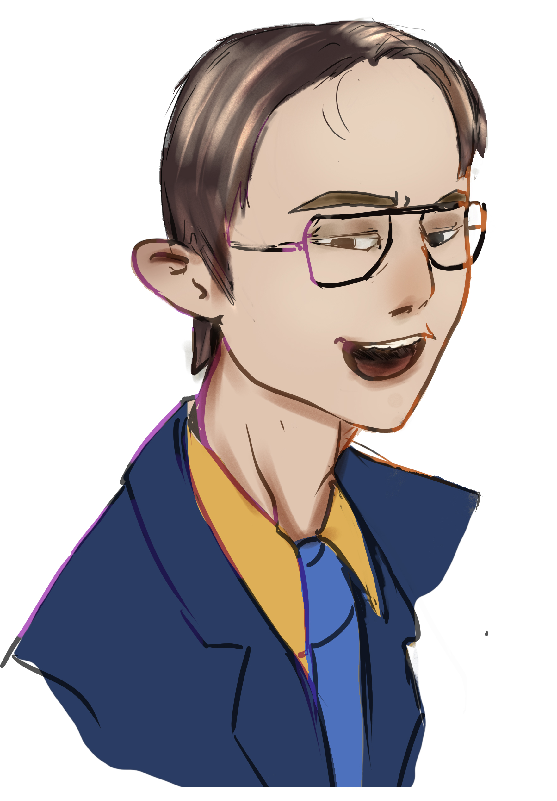
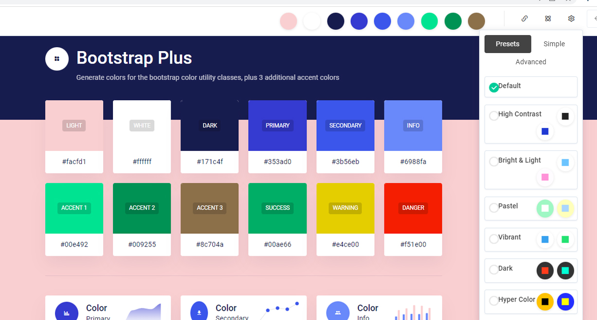
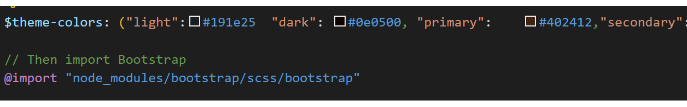

# Intro

    
   

Muy buenas joven aprendiz,  de ahora en adelante seré tu maestro y lider técnico de este departamento, yo, Drumond Schofield. He estado hablando con el resto del equipo y hemos decidido asignarte una serie de tareas para que vayas familiarizandote con tu trabajo, ve a hablar con b primero y el te lo comentará con más detalle. 

# Parte 1

Hey, que tal, chic@ nuevo, si no recuerdo mal el otro día ya instalaste una versión del entorno, verdad?, confío en que esta vez serás capaz de sacar algo adelante. Bueno, si ya has lanzado el comando `npm install` deberías ser capaz de levantar el servidor con `gulp`y empezar a trabajar. 

- Crea una nueva páginas de nombre buscador y referencialas desde el menu, comprueba que la nueva página funcione.
- Integra en la pestaña buscador el código que habías desarrollado antes, para ello tendras que copiar el javascript, html y sass. 

# Parte 2
Hey, que tal, soy Amanda, la encargada de diseño, en esta tarea quiero poner a prueba tu sentido del estilo, utiliza la siguiente página para crear una paleta de colores, piensa en una paleta que nos represente, busca una buena proporción en las combinaciones, no tiene que ser la definitiva a si que tampoco le dediques demasiado!

    
   <a href="https://huemint.com/bootstrap-plus/"> https://huemint.com/bootstrap-plus/</a>

Cuando hayas terminado, copia su código y pegalo antes de importar bootstrap en tu fichero sass. Recuerda que los arrays van en una línea o tendrás un error de compilación.

    

Una cosa más, estaría bien si puedieras descubrir alguna forma de que podamos cambiar la paleta de colores de la interfaz y ver los cambios al momento.