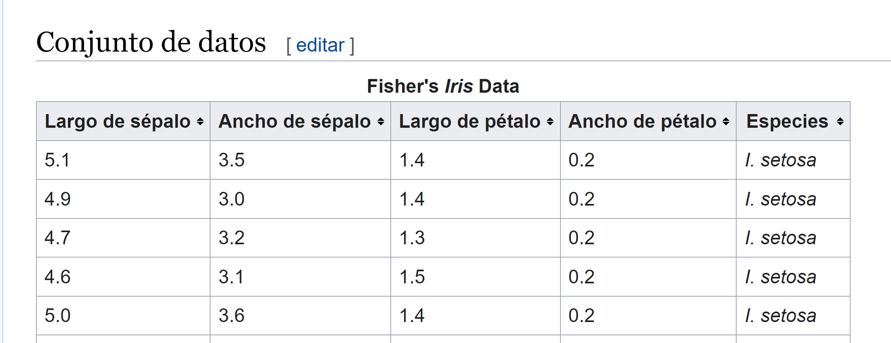

# Día 1

    
   

Muy buenas joven aprendiz,  de ahora en adelante seré tu maestro y lider técnico de este departamento, yo, Drumond Schofield. He estado hablando con el resto del equipo y hemos decidido asignarte una serie de tareas para que vayas familiarizandote con tu trabajo, ve a hablar con b primero y el te lo comentará con más detalle. 

Hey, que tal, chic@ nuevo, si no recuerdo mal el otro día ya instalaste una versión del entorno, verdad?, confío en que esta vez serás capaz de sacar algo adelante. Bueno, si ya has lanzado el comando `npm install` deberías ser capaz de levantar el servidor con `gulp`y empezar a trabajar. 

Necesitamos que termines de arreglar el menu, asegurarte de que funciona bien y responde a ditintas pantallas, luego, necesito que añadas algún elemento de bootstrap más, concretamente:
- footer
- Crea 2 nuevas páginas y referencialas desde el menu, llamalas contacto y buscador.
- Integra en la pestaña buscador el código que habías desarrollado antes, para ello tendras que copiar el javascript, html y sass. Para los htmls, utiliza index.html como plantilla y cambia el contenido conservando el header.

Hey, que tal, soy Amanda, la encargada de diseño, en esta tarea quiero poner a prueba tu sentido del estilo, utiliza la siguiente página para crear una paleta de colores, piensa en una paleta que nos represente, busca una buena proporción en las combinaciones, no tiene que ser la definitiva a si que tampoco le dediques demasiado!

    
   <a href="https://huemint.com/bootstrap-plus/"> https://huemint.com/bootstrap-plus/</a>

Cuando hayas terminado, copia su código y pegalo antes de importar bootstrap en tu fichero sass. Recuerda que los arrays van en una línea o tendrás un error de compilación.

    

Vale, buena sesión, vamos a estirar las patas un poco y despejarnos con un cafecito novato
sigue así!

Hola otra vez novato, se me ha olvidado decirte pero deberías descubrir alguna forma de que podamos cambiar la paletad de colores de la interfaz y ver los cambios al momento.

# Día 2

## Preparación

Descargar base de datos iris y copia el json que contiene en el proyecto, en una ubicación apropiada.

https://drive.google.com/file/d/1lC6HwrAov4mBwJU0nsv0ugaAoZIvxFAz/view?usp=sharing
https://es.wikipedia.org/wiki/Conjunto_de_datos_flor_iris

    

1. Creamos una nueva página copiando alguna de las que no son el index.
   
2. Modificamos el gulpfile, creamos un fichero html, sass y js y trabajaremos solo con estos 
ficheros asi que queremos sean los unicos que considere gulp, el resto seguiran generados en el build y accesibles, pero los cambios no se verán reflejados

3. Una vez terminado el paso anterior, cargamos la base de datos de Iris siguiendo la estrategia de cargar ficheros que ya hemos visto. 
   1. Tip: Usa control + P y pon *.js, varios de los primero js sugeridos deberían implementar esta estrategia.
   2. Comprueba con la herramienta para desarrolladores y el debugger de chrome que los datos se cargan.

## Tarea

1. La idea es crear una serie de componentes independientes, cada componente tendrá un modelo, una vista y una actualización.
   
2. Se crearán 4 componentes, por lo que se dividirá la pantalla en una malla de 50%,50% y dentro de cada sección iremos añadiendo los componentes.

Estrategia
    1. La estrategia es dividir el modelo vista actualización en dos niveles, con un modelo vista actualización a nivel general
    2. Un modelo vista actualización por cada componentes
    3. Un init por componente
    4. Una vista por componente
    5. Una actualización por componente

# Día 3

## Practica de Listas

En el menu de la aplicación hay un nuevo menu de nombre listas.

Buscamos scatterplot en esta librería
https://d3js.org/
https://observablehq.com/@d3/splom

https://animejs.com/documentation/#gridAxisStaggering